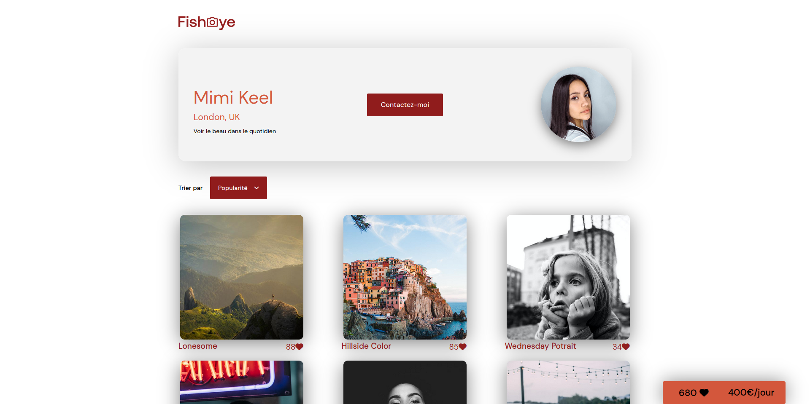

FishEye
=======

FishEye est une plateforme pour photographes freelances.
Site étudié pour l'accessibilité : 
- Possibilité de le consulter uniquement avec le clavier
- Possibilite de le consulter avec un lecteur d'écran
- Aria label, alt, balises sémentiques adaptées




Installation
------------

En local, il faudra servir le fichier ```photographers.json``` et ouvrir ```index.html```.
Aucune dépendance.

Lien vers Démo live
-------------------
[Lien vers FishEye](https://geo-tp.github.io/Front-End-Fisheye/index.html)
